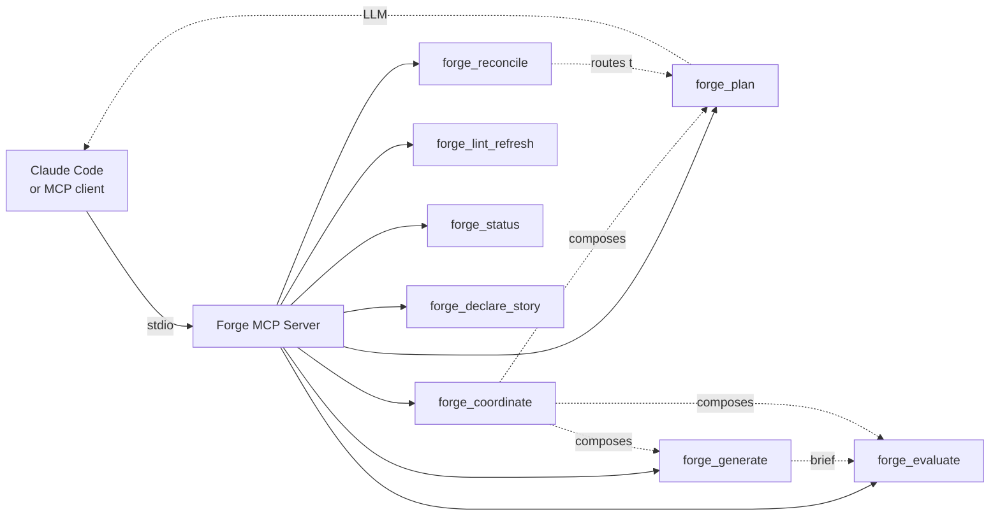

# Forge Harness

[](LICENSE)
[](https://nodejs.org)
[](https://github.com/ziyilam3999/forge-harness/releases)

Composable AI primitives where the harness coordinates and the agent implements. Eight MCP primitives, only one of them ever talks to the LLM — the rest are deterministic orchestration.

Successor to [Hive Mind v3](https://github.com/ziyilam3999/hive-mind). Each primitive works standalone and composes together.

## Why forge-harness?

Most AI agent frameworks call the LLM for everything — routing decisions, tool dispatch, verdict grading, state updates. Tokens add up fast, and "did this actually pass" becomes a question the LLM answers (with all the drift, reroll, and hallucination that implies).

forge-harness inverts that. Of the eight registered MCP primitives, only `forge_plan` actually talks to Claude. The rest are **deterministic orchestration** — they read disk, classify state, assemble briefs, and run shell commands. Same inputs, same outputs. No LLM re-judging, no verdict drift between runs.

**The implementation work itself runs in your Claude Code session** — which on a Max subscription is flat-rate free. forge-harness never calls Claude "on your behalf" to write code; it hands the agent a brief and the agent goes to work.

**Receipt** from a real 13-story project shipped with forge-harness (monday-bot, 4 stories shipped at time of writing):

- **16 tool calls, 2 paid, 14 free** — the two paid calls were both `forge_plan` invocations
- **$0.80 total** for the entire phase plan, amortized to **$0.20 per story** so far
- On Max plan: **$0 out-of-pocket** — the $0.80 is API-equivalent cost, covered by the subscription
- Extrapolated to all 13 stories: ~$2.60 forge-harness LLM spend total — all of it through `forge_plan`

**Deterministic verdicts.** `forge_evaluate` runs the commands you wrote in your execution plan's acceptance criteria — `npm run build && npm test`, `node -e "..."`, whatever. If your test passes, the story passes. If it fails, the story fails. You never need to wonder if the grader was having a bad day.

## Quick Start

```bash
git clone https://github.com/ziyilam3999/forge-harness.git
cd forge-harness
./setup.sh
```

Then restart Claude Code. The forge tools will appear in your tool list.

## Tools

| Tool | What It Does | LLM? | Phase |
|------|-------------|------|-------|
| `forge_plan` | Transform a PRD into a structured execution plan with binary acceptance criteria | Yes (Sonnet 4.6) | 1 — Planning |
| `forge_evaluate` | Run the plan's AC shell commands and grade PASS/FAIL per criterion with evidence | No¹ | 2 — Verdicts |
| `forge_generate` | Assemble an implementation brief (plan excerpt + codebase context + git state) for the calling agent | No | 3 — Implementation kickoff |
| `forge_coordinate` | Read disk state, classify stories into ready/pending/done, emit a phase-transition brief | No | 4 — Composition |
| `forge_reconcile` | Intelligent Clipboard for plan-writeback — sorts replanning notes, halts on blockers, routes drift back to plan-update | No² | 5 — Reconciliation |
| `forge_status` | Read-only snapshot of plan state, merging disk records with in-memory declarations | No | (Observability) |
| `forge_declare_story` | Agent declaration: "I'm implementing story X now" — in-memory singleton, surfaces in `forge_status` | No | (Observability) |
| `forge_lint_refresh` | Re-lint an execution plan file against the current schema; reports stale `lintExempt` entries | No | (Housekeeping) |

**Only `forge_plan` costs tokens.** The other seven are deterministic and cost $0 per call. Your agent session (Claude Code, etc.) does the actual implementation work.

¹ `forge_evaluate` has a rarely-used `coherence` sub-mode that is LLM-judged for cross-document alignment checks; the dominant `story` mode is deterministic.
² `forge_reconcile` is itself deterministic; its `ac-drift` and `assumption-changed` routes can fire `forge_plan(documentTier:'update')` downstream, which costs tokens at that point.

## Status

Active. All eight primitives are implemented and shipping releases on a regular cadence — see [Releases](https://github.com/ziyilam3999/forge-harness/releases) for the latest. The harness is dogfooded daily on its own development.

## Development

```bash
npm install       # Install dependencies + git hooks
npm run build     # Compile TypeScript
npm test          # Run Vitest suite
npm run lint      # Run ESLint
```

## Architecture

Forge runs as a local MCP server — a Node subprocess that Claude Code (or any MCP client) connects to over stdio. No network calls except `forge_plan`'s LLM round-trip; everything else stays on your machine.



Solid arrows: registered MCP tools. Dotted arrows: composition / data-flow.

`forge_plan` is the only primitive that calls the LLM. `forge_reconcile` can route back through `forge_plan` for plan updates, but is itself deterministic.

See `docs/forge-harness-plan.md` for the full design spec.

## License

MIT
