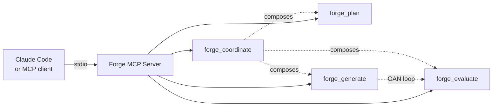

# Forge Harness

[](LICENSE)
[](https://nodejs.org)
[](https://github.com/ziyilam3999/forge-harness/releases)

Composable AI primitives — plan, evaluate, generate, coordinate — as a local MCP server.

Successor to [Hive Mind v3](https://github.com/ziyilam3999/hive-mind). Each primitive works standalone and composes together.

## Quick Start

```bash
git clone https://github.com/ziyilam3999/forge-harness.git
cd forge-harness
./setup.sh
```

Then restart Claude Code. The forge tools will appear in your tool list.

## Tools

| Tool | What It Does | Phase |
|------|-------------|-------|
| `forge_plan` | Transform intent into a structured execution plan with binary acceptance criteria | 1 |
| `forge_evaluate` | Grade work against the contract — PASS/FAIL per criterion with evidence | 2 |
| `forge_generate` | Implement one story via GAN loop (implement, evaluate, fix) | 3 |
| `forge_coordinate` | Compose plan/generate/evaluate into dependency-ordered workflows | 4 |

## Status

Active. All four primitives are implemented and shipping releases on a regular cadence — see [Releases](https://github.com/ziyilam3999/forge-harness/releases) for the latest. The harness is dogfooded daily on its own development.

## Development

```bash
npm install       # Install dependencies + git hooks
npm run build     # Compile TypeScript
npm test          # Run Vitest suite
npm run lint      # Run ESLint
```

## Architecture

Forge runs as a local MCP server — a Node subprocess that Claude Code (or any MCP client) connects to over stdio. No network calls; everything stays on your machine.



See `docs/forge-harness-plan.md` for the full design spec.

## License

MIT
