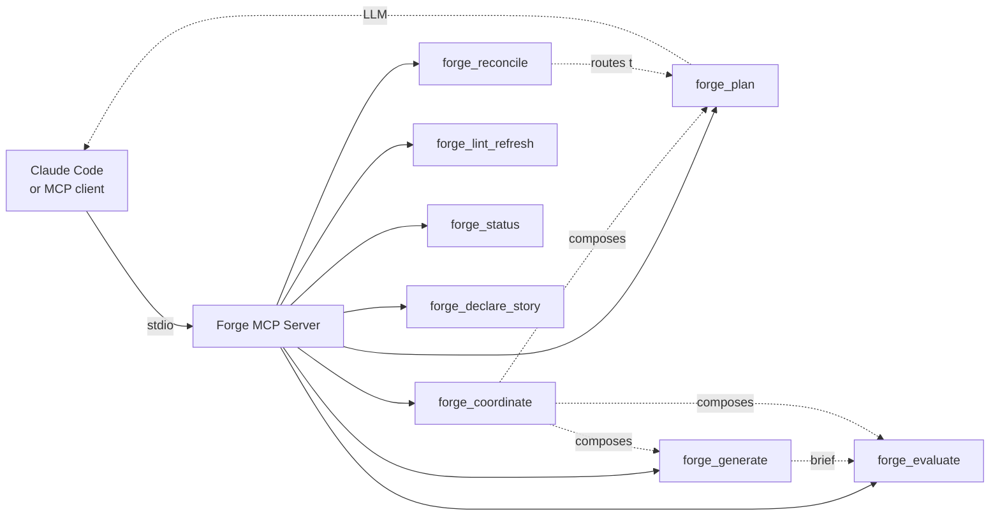

# Forge Harness

[](LICENSE)
[](https://nodejs.org)
[](https://github.com/ziyilam3999/forge-harness/releases)

Composable AI primitives where the harness coordinates and the agent implements. Eight MCP primitives, only one of them ever talks to the LLM — the rest are deterministic orchestration.

Successor to [Hive Mind v3](https://github.com/ziyilam3999/hive-mind). Each primitive works standalone and composes together.

## Why forge-harness?

Most AI agent frameworks call the LLM for everything — routing decisions, tool dispatch, verdict grading, state updates. Tokens add up fast, and "did this actually pass" becomes a question the LLM answers (with all the drift, reroll, and hallucination that implies).

forge-harness inverts that. Of the eight registered MCP primitives, only `forge_plan` actually talks to Claude. The rest are **deterministic orchestration** — they read disk, classify state, assemble briefs, and run shell commands. Same inputs, same outputs. No LLM re-judging, no verdict drift between runs.

**The implementation work itself runs in your Claude Code session** — which on a Max subscription is flat-rate free. forge-harness never calls Claude "on your behalf" to write code; it hands the agent a brief and the agent goes to work.

**Receipt** from a real 13-story project shipped with forge-harness (monday-bot, 4 stories shipped at time of writing):

- **16 tool calls, 2 paid, 14 free** — the two paid calls were both `forge_plan` invocations
- **$0.80 total** for the entire phase plan, amortized to **$0.20 per story** so far
- On Max plan: **$0 out-of-pocket** — the $0.80 is API-equivalent cost, covered by the subscription
- Extrapolated to all 13 stories: ~$2.60 forge-harness LLM spend total — all of it through `forge_plan`

**Deterministic verdicts.** `forge_evaluate` runs the commands you wrote in your execution plan's acceptance criteria — `npm run build && npm test`, `node -e "..."`, whatever. If your test passes, the story passes. If it fails, the story fails. You never need to wonder if the grader was having a bad day.

## Quick Start

```bash
git clone https://github.com/ziyilam3999/forge-harness.git
cd forge-harness
./setup.sh
```

Then restart Claude Code. The forge tools will appear in your tool list.

`./setup.sh` also installs the **`/prd` skill** into your global Claude Code skills directory (`~/.claude/skills/prd/`), so `/prd` is available in every project. `/prd` is the companion that authors `forge_plan`'s input — it runs a guided product diagnostic and writes a PRD, the vision doc `forge_plan` turns into an execution plan.

## From PRD to plan

`/prd` and `forge_plan` are a two-step flow: `/prd` writes the PRD, `forge_plan` turns it into a structured execution plan.

1. **Author the PRD.** In Claude Code, run `/prd`. It runs a product diagnostic (challenges your premise, validates demand, scopes the narrowest wedge), then writes the PRD to `PRD.md` (default).
2. **Hand the PRD to `forge_plan`.** Pass the PRD's contents as the vision doc. Lead with the master tier to decompose it into phases:

   ```javascript
   forge_plan({ documentTier: "master", visionDoc: <contents of PRD.md> })
   ```

   Or, for a single focused plan, pass it as `intent`:

   ```javascript
   forge_plan({ intent: <contents of PRD.md> })
   ```

## Tools

| Tool | What It Does | LLM? | Phase |
|------|-------------|------|-------|
| `forge_plan` | Transform a PRD into a structured execution plan with binary acceptance criteria | Yes (Sonnet 4.6) | 1 — Planning |
| `forge_evaluate` | Run the plan's AC shell commands and grade PASS/FAIL per criterion with evidence | No¹ | 2 — Verdicts |
| `forge_generate` | Assemble an implementation brief (plan excerpt + codebase context + git state) for the calling agent | No | 3 — Implementation kickoff |
| `forge_coordinate` | Read disk state, classify stories into ready/pending/done, emit a phase-transition brief | No | 4 — Composition |
| `forge_reconcile` | Intelligent Clipboard for plan-writeback — sorts replanning notes, halts on blockers, routes drift back to plan-update | No² | 5 — Reconciliation |
| `forge_status` | Read-only snapshot of plan state, merging disk records with in-memory declarations | No | (Observability) |
| `forge_declare_story` | Agent declaration: "I'm implementing story X now" — in-memory singleton, surfaces in `forge_status` | No | (Observability) |
| `forge_lint_refresh` | Re-lint an execution plan file against the current schema; reports stale `lintExempt` entries | No | (Housekeeping) |

**Only `forge_plan` costs tokens.** The other seven are deterministic and cost $0 per call. Your agent session (Claude Code, etc.) does the actual implementation work.

¹ `forge_evaluate` has a rarely-used `coherence` sub-mode that is LLM-judged for cross-document alignment checks; the dominant `story` mode is deterministic.
² `forge_reconcile` is itself deterministic; its `ac-drift` and `assumption-changed` routes can fire `forge_plan(documentTier:'update')` downstream, which costs tokens at that point.

## Status

Active. All eight primitives are implemented and shipping releases on a regular cadence — see [Releases](https://github.com/ziyilam3999/forge-harness/releases) for the latest. The harness is dogfooded daily on its own development.

## Development

```bash
npm install       # Install dependencies + git hooks
npm run build     # Compile TypeScript
npm test          # Run Vitest suite
npm run lint      # Run ESLint
```

## Troubleshooting

### Max-plan OAuth-tier rate-limit (429)

If you're running forge-harness with Claude Code's Max-plan OAuth login (no `ANTHROPIC_API_KEY` set), high-volume spec regeneration can hit the Max-plan OAuth rate-limit bucket. The OAuth bucket is **separate from the API-key bucket** — it has its own (tighter, undocumented) limits and isn't visible in the Anthropic console.

Symptoms:

- `spec-gen-shell-only` warning with `429 rate_limit_error` in the run record
- Often co-emitted with a misleading `spec-gen-creds-keychain-only` warning (see [#546](https://github.com/ziyilam3999/forge-harness/issues/546))
- The failing request_ids do **not** appear in your Anthropic console Logs view — because that console only shows API-key traffic

**Workaround:** set `ANTHROPIC_API_KEY` from a separate API-key identity. The API-key path uses a different rate-limit bucket and bypasses the OAuth tier entirely. API-key traffic is also visible in your Anthropic console for cost tracking.

```bash
export ANTHROPIC_API_KEY=sk-ant-...
```

Get an API key at: https://console.anthropic.com/settings/keys

After setting the env var, restart Claude Code so the forge MCP child picks up the new environment.

### Handling the `generate-spec-inline` directive (v0.43.0+)

Starting in v0.43.0, `forge_evaluate`'s PASS path **does not call Anthropic itself**. Instead it returns a directive asking the calling Claude Code session to do the spec-gen LLM round-trip inline. This sidesteps Max-plan OAuth's header-less anti-abuse 429s entirely — the MCP child no longer hits the Anthropic API for spec-gen.

**v0.43.1 surfacing fix.** Starting in v0.43.1, the directive fields (`callerAction`, `specGenBrief`, `specGenWarnings`) are embedded INSIDE `content[0].text` as JSON-stringified data so standard MCP clients (which render the `content` field) can reach them via `JSON.parse(result.content[0].text)`. The v0.43.0 envelope-sibling shape (`result.callerAction`, `result.specGenBrief`) is retained for envelope-aware clients — same data on both surfaces, belt-and-suspenders. **Use the `JSON.parse` access path** in new caller integrations:

```javascript
const parsed = JSON.parse(result.content[0].text);
if (parsed.callerAction === "generate-spec-inline") {
  const brief = parsed.specGenBrief;
  // ... act on the directive
}
```

The MCP response shape on a story-mode PASS (post-`JSON.parse(content[0].text)`):

```json
{
  "storyId": "US-13",
  "verdict": "PASS",
  "criteria": [{ "id": "AC-01", "status": "PASS", "evidence": "ok" }],
  "callerAction": "generate-spec-inline",
  "specGenBrief": {
    "storyId": "US-13",
    "runId": "a1b2",
    "specPath": "/path/to/docs/generated/TECHNICAL-SPEC.md",
    "affectedPaths": ["src/runMonday.ts"],
    "systemPrompt": "You are the spec-generator ...",
    "userPrompt": "## Story\nUS-13\n\n## Eval verdict\nPASS\n...",
    "vocabularyPrompt": "## Real symbols available\n- `runMonday` ...",
    "diffSummary": "...git diff --stat output...",
    "evalReport": { "verdict": "PASS", "criteria": [...] },
    "expectedSections": ["api-contracts", "data-models", "invariants", "test-surface"],
    "currentSectionContent": {
      "api-contracts": "...",
      "data-models": "...",
      "invariants": "...",
      "test-surface": "..."
    }
  },
  "specGenWarnings": []
}
```

Six-step caller-side flow:

1. **Detect the directive.** Parse `result.content[0].text` as JSON and inspect `parsed.callerAction === "generate-spec-inline"`. When absent (hand-author short-circuit, non-PASS verdict, or `FORGE_SPEC_CALLER_ACTION=0` opt-out), do nothing — there's no caller work. (Envelope-aware clients may also read `result.callerAction` directly; both surfaces carry the same value.)
2. **Extract the prompts.** Read `parsed.specGenBrief.systemPrompt` and `parsed.specGenBrief.userPrompt`. Both are pre-rendered server-side; do NOT re-assemble.
3. **Call your LLM.** Send the system + user message to your Anthropic connection (the calling Claude Code session's own, which is the path that works — the MCP child is the one with the OAuth-bucket issue). Request JSON-mode output. The model returns a single JSON object matching this schema:
   ```json
   {
     "contracts": ["forge_evaluate", "forge_generate"],
     "sections": {
       "api-contracts": "<markdown>",
       "data-models": "<markdown>",
       "invariants": "<markdown>",
       "test-surface": "<markdown>"
     }
   }
   ```
4. **Parse the response.** Validate that `sections` contains exactly the four keys from `parsed.specGenBrief.expectedSections`. Each section is a Markdown bullet list (or the literal string `"(none)"`). Capture the `tokens` your LLM client reports — `{inputTokens, outputTokens}`.
5. **Call `forge_apply_spec_gen`.** Invoke the MCP tool with `{runId, storyId, projectPath, sections, contracts, tokens, affectedPaths, gitSha}`. The `runId` MUST be the one from the brief (`parsed.specGenBrief.runId`) so the merge event lands on the same run-record file as the brief-emit event. `affectedPaths` and `gitSha` are echoed from the brief for vocabulary-grounding + front-matter stamping.
6. **Verify success.** The tool returns `{specPath, warnings, contracts, bodyChanged, runRecordPath}`. Success = `runRecordPath` is non-null AND `warnings` contains no `spec-gen-empty-sections` entries.

**Opt-out: legacy v0.42.x in-MCP synth.** Set `FORGE_SPEC_CALLER_ACTION=0` in the environment that launches the MCP server (e.g., your Claude Code config). The PASS path then calls Anthropic directly via the legacy `generateSpecForStory` code path. Use this only when you have a stable API-key identity (not Max-plan OAuth) and want the simpler one-shot flow. Both v0.42.0's preserve-invariant and v0.42.1's retry-on-429 remain active on the legacy path; both inherit by reuse on the new path's `forge_apply_spec_gen` merge half.

**What gets logged on startup.** The MCP server emits one stderr line at module-load time indicating which path is active:

```
forge-harness: spec-gen via caller-action directive enabled (default since v0.43.0); opt back with FORGE_SPEC_CALLER_ACTION=0
```

or (when `FORGE_SPEC_CALLER_ACTION=0`):

```
forge-harness: spec-gen via legacy in-MCP synth (FORGE_SPEC_CALLER_ACTION=0)
```

Grep your MCP server logs for these strings to confirm the active mode.

### Spec-generator retry-on-429 + preserve-on-failure invariant (v0.42.0)

When `forge_evaluate` returns PASS, the spec-generator regenerates the story's section of `docs/generated/TECHNICAL-SPEC.md`. v0.42.0 changes the LLM-failure behaviour:

- **No-overwrite invariant.** If the underlying LLM call fails (rate-limit, locked Keychain, any HTTP 4xx/5xx, network blip) OR returns empty / all-`(none)` sections, the spec file is **left untouched**. Existing hand-authored content is preserved. The warnings (`spec-gen-shell-only`, `spec-gen-empty-sections`) still surface on the run record and the MCP response so consumers see the failure cause loudly. Pre-v0.42.0 the failure path overwrote real content with a placeholder body — a silent data-loss bug. There is no env-var kill-switch for the no-overwrite invariant; escape is via revert.
- **`FORGE_SPEC_RETRY_ON_429`** (default `60`, in seconds) — when set to a non-zero integer, the spec-generator retries an HTTP 429 once, honouring the `Retry-After` header and clamping the sleep to this value. Set to `0` to disable retry entirely. The cap defends against an upstream advertising a multi-minute backoff that would otherwise stall the MCP tool-call past common operator-configured timeouts. The Anthropic SDK's hidden default of 2 internal retries is explicitly disabled (`maxRetries: 0`) so this is the only retry layer in play.

```bash
# Disable retry-on-429 entirely (recover pre-v0.42.0 behaviour for retries
# only; the no-overwrite invariant still applies).
export FORGE_SPEC_RETRY_ON_429=0

# Tighten the cap to 30s for an operator with a stricter MCP timeout budget.
export FORGE_SPEC_RETRY_ON_429=30
```

### Advanced: tune 429 retry behavior (v0.42.1+)

For environments with multiple concurrent forge-harness consumers (e.g. Claude Code main session + MCP child + monday-bot), the default retry-on-429 may exhaust before the OAuth rate-limit window clears. Three knobs:

- `FORGE_SPEC_RETRY_ON_429_FALLBACK_SEC` (default `30`): seconds to sleep when a 429 response has no `retry-after` header (the common case for Max-plan OAuth). Bounded by `FORGE_SPEC_RETRY_ON_429` cap (default 60).
- `FORGE_SPEC_RETRY_ON_429_ATTEMPTS` (default `2`): number of retry attempts after the initial call. Set to `1` for v0.42.0 behavior; `0` to disable retry (equivalent to `FORGE_SPEC_RETRY_ON_429=0`). Retries use exponential backoff: retry N (0-indexed) sleeps `min(FALLBACK_SEC * 2^N, cap)` seconds.
- `FORGE_SPEC_RETRY_ON_429_JITTER_PCT` (default `10`, range `0..50`): random jitter ±N% applied to each sleep. Prevents thundering-herd lockstep across concurrent consumers sharing one OAuth bucket. Set to `0` for deterministic sleeps (testing only).

When retries exhaust on 429, the run record's `generatedDocs.warnings` AND the MCP response's `specGenWarnings` will contain a `spec-gen-rate-limit-exhausted` warning kind with operator-actionable guidance. The `TECHNICAL-SPEC.md` file is preserved (v0.42.0+ no-overwrite invariant) — only the spec regeneration is skipped.

```bash
# Heavier retry budget for multi-consumer setups (3 retries with 60s base).
export FORGE_SPEC_RETRY_ON_429_FALLBACK_SEC=60
export FORGE_SPEC_RETRY_ON_429_ATTEMPTS=3
export FORGE_SPEC_RETRY_ON_429=240   # raise cap so the 3rd retry (240s) isn't clipped

# Restore exact v0.42.0 behavior (single retry, 1s header-less fallback).
export FORGE_SPEC_RETRY_ON_429_ATTEMPTS=1
export FORGE_SPEC_RETRY_ON_429_FALLBACK_SEC=1
```

### I pulled but my changes don't seem live (stale `dist/`)

forge-harness ships compiled JavaScript in `dist/`. The MCP server loads `dist/index.js` (per `package.json` `scripts.start`) — source `.ts` files are never executed directly. When you `git pull` after a release, the new TypeScript source lands but `dist/` is left untouched until you rebuild. If you smoke-test before rebuilding, you're testing yesterday's compiled code and the results lie silently.

**Automatic fix (default since the post-merge hook landed):** `npm install` once installs `post-merge` and `post-rewrite` git hooks. They auto-run `npm run build` after every `git pull` (default merge or `--rebase`) when source under `server/` is newer than `dist/`. The hooks no-op in ~50 ms when `dist/` is already fresh, and write an execution marker at `.git/.forge-rebuild-hook-marker` (JSON: `{lastRunAt, lastRebuildAt, trigger}`) so you can verify they fired.

**Manual fallback** (if you skipped `npm install` after pulling, or the hook isn't installed yet):

```bash
npm run build
```

**Bypass for one pull** (e.g., A/B-comparing yesterday's `dist/` against today's source):

```bash
git -c hooks.post-merge=false pull
git -c hooks.post-rewrite=false pull --rebase  # if you use rebase pull
```

**After a rebuild, restart your Claude Code session.** The MCP server loads modules once at startup; rebuilding `dist/` on disk doesn't propagate to a running MCP child (the F54 trap, runtime variant). The hook prints a reminder to this effect when it rebuilds.

## Architecture

Forge runs as a local MCP server — a Node subprocess that Claude Code (or any MCP client) connects to over stdio. No network calls except `forge_plan`'s LLM round-trip; everything else stays on your machine.


```mermaid
graph LR
    CC[Claude Code<br/>or MCP client] -->|stdio| F[Forge MCP Server]
    F --> P[forge_plan]
    F --> E[forge_evaluate]
    F --> G[forge_generate]
    F --> C[forge_coordinate]
    F --> R[forge_reconcile]
    F --> L[forge_lint_refresh]
    F --> S[forge_status]
    F --> D[forge_declare_story]
    P -.LLM.-> CC
    G -.brief.-> E
    C -.composes.-> P
    C -.composes.-> G
    C -.composes.-> E
    R -.routes to.-> P
```

Solid arrows: registered MCP tools. Dotted arrows: composition / data-flow.

`forge_plan` is the only primitive that calls the LLM. `forge_reconcile` can route back through `forge_plan` for plan updates, but is itself deterministic.

See `docs/forge-harness-plan.md` for the full design spec.

## License

MIT
